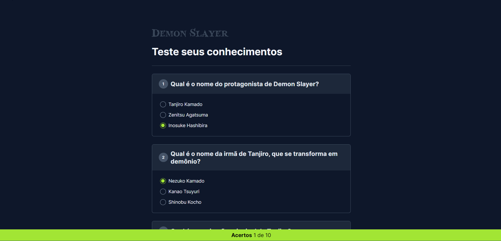

# Demon Slayer Quiz

O Demon Slayer Quiz é uma aplicação web que oferece um quiz interativo sobre o anime Demon Slayer. Os usuários podem testar seus conhecimentos respondendo a perguntas relacionadas à série.

Este projeto faz parte da Trilha de **HTML + CSS + JavaScript** no evento NLW Expert da RocketSeat, originalmente voltado para perguntas sobre JavaScript e adaptado para o universo de Demon Slayer.

Link de acesso: [Demon Slayer Quiz](https://emilaynerodrigues.github.io/demon-slayer-quiz/)

## Funcionalidades Principais

1. **Quiz Interativo**: Responda perguntas sobre Demon Slayer e teste seus conhecimentos sobre o anime.
2. **Exibição de Resultados**: Receba feedback imediato sobre suas respostas corretas e incorretas.
3. **Interface Amigável**: Design intuitivo e agradável para uma experiência de usuário aprimorada.

## Tecnologias Utilizadas

- **HTML**: Estruturação e marcação do conteúdo.
- **CSS**: Estilização para uma apresentação visual atraente.
- **JavaScript**: Interatividade e dinamismo no carregamento e navegação do conteúdo.
- **GPT-3 (OpenAI)**: Aplicação da tecnologia GPT-3 para assistência na criação de perguntas e respostas adaptadas.

## Demonstração

